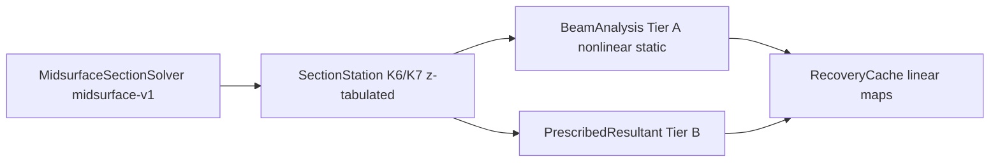

# Beam and section model limitations (tidal blade project)

## Project framing

The stack is organized in analysis tiers ([`blade_precompute/global_beam_model/core/tier_paths.py`](../blade_precompute/global_beam_model/core/tier_paths.py)): **Tier A** is the full Simo–Reissner + Vlasov warping beam solve; **Tier B** ([`blade_precompute/section_optimisation/engine/beam_k7.py`](../blade_precompute/section_optimisation/engine/beam_k7.py)) prescribes envelope resultants with a small-curvature nodal frame; **Tier C** ([`recovery_cache/engine/builder.py`](../recovery_cache/engine/builder.py)) uses fused **linear** stress operators. Limitations differ slightly by tier but share the same section-level assumptions.

---

## Beam model (`global_beam_model`) limitations

**Constitutive / section coupling**

- **Linear elastic section law:** Stiffness is a fixed `K7` (or `K6` + synthesized warping diagonal) per Gauss station; no plasticity, damage, or stiffness update with deformation ([`blade_precompute/global_beam_model/__init__.py`](../blade_precompute/global_beam_model/__init__.py), [`blade_precompute/global_beam_model/engine/constitutive.py`](../blade_precompute/global_beam_model/engine/constitutive.py)).
- **Spanwise stiffness:** `K6`/`K7` are **piecewise-linearly interpolated** in `z` between tabulated stations ([`blade_precompute/global_beam_model/engine/interp.py`](../blade_precompute/global_beam_model/engine/interp.py)); this ignores abrupt layup jumps unless stations are dense.
- **Missing full `K7` data:** If `SectionStation.K7` is omitted, the code **decouples** warping from bending/shear via `block_diag(K6, K₍ww₎)` with **zero `k_w` coupling** ([`blade_precompute/global_beam_model/core/types.py`](../blade_precompute/global_beam_model/core/types.py) docstring; [`blade_precompute/global_beam_model/engine/constitutive.py`](../blade_precompute/global_beam_model/engine/constitutive.py) `synthesize_K7`).

**Geometry / kinematics vs. real blade physics**

- **Level-2 gap (explicitly out of scope):** **Section shape distortion under large torsion** (order of magnitude **> ~15°**) is not modelled; documentation points to shell-based section analysis ([`blade_precompute/global_beam_model/__init__.py`](../blade_precompute/global_beam_model/__init__.py), [`blade_precompute/global_beam_model/core/types.py`](../blade_precompute/global_beam_model/core/types.py)).
- **Reference geometry:** Blade → beam uses **linear resampling** of `r_ref` and reference curvatures along `z_stations` ([`blade_precompute/global_beam_model/engine/blade_geometry.py`](../blade_precompute/global_beam_model/engine/blade_geometry.py)); twist rate `tau0` is folded into the first curvature component of `kappa0` (documented in that file)—a modelling choice users must interpret correctly for highly twisted blades.
- **Elements:** **Two-node straight** reference segments with low-order Gauss (**only 1- or 2-point** rules implemented) ([`blade_precompute/global_beam_model/engine/element.py`](../blade_precompute/global_beam_model/engine/element.py)).

**Solver / analysis scope**

- **Reference CLI:** A built-in nonlinear static smoke case is exposed as `python -m blade_precompute.global_beam_model` ([`blade_precompute/global_beam_model/__main__.py`](../blade_precompute/global_beam_model/__main__.py)); optional `--verbose`, `--print-spanwise`, and plotting flags match the former standalone script (now [`example_beam_static.py`](../example_beam_static.py), which delegates here).
- **Static equilibrium only:** No explicit time domain, modes, or damping in `global_beam_model` (no dynamic/modal paths in this package).
- **Arc-length:** `use_arc_length` exists but **full arc-length continuation is not implemented**; load stepping still applies when enabled ([`blade_precompute/global_beam_model/engine/solver.py`](../blade_precompute/global_beam_model/engine/solver.py) docstring).
- **Tier B:** Internal forces are **prescribed**, not solved from equilibrium; `nodal_R` uses `rotmat_from_small_curvature` from `kappa0` ([`blade_precompute/section_optimisation/engine/beam_k7.py`](../blade_precompute/section_optimisation/engine/beam_k7.py))—inconsistent with Tier A’s large-rotation quaternions if used as a substitute for true nonlinear beam response.

---

## Section model (`section_model`) limitations

**Theory fidelity (documented in code)**

- **Tag `midsurface-v1`:** Strip-wise **CLPT**, **graph Laplacian** warping on a 1D line mesh, and **Bernoulli-style** membrane–bending coupling; explicitly **“Not publication-grade Vlasov shell theory”** ([`section_model/engine/solver.py`](../section_model/engine/solver.py) module docstring).
- **Shear center:** [`shear_center_estimate`](../section_model/engine/section_properties.py) is an **energy-style thin-walled analogue** with fallback to the elastic centroid—not a rigorous open-section thin-walled shear-center derivation.
- **Torsion stiffness:** `GJ` is accumulated from strip scalings including a **classic thin rectangular** `t³/3` term per strip ([`_assemble_K6_open_strip`](../section_model/engine/solver.py)); accuracy is limited for **multicell topology, thick walls, or strips that do not match thin rectangular strips**—independent of whether the **outer blade profile** looks “chunky” or deep-chord. A tidal blade can still be **thin-walled** structurally while having a **stocky outer profile**.
- **Shear stiffness:** Transverse shear entries use a fixed `α = 5/6` Timoshenko-style factor on integrated `GA` ([`_assemble_K6_open_strip`](../section_model/engine/solver.py)). Under **shear-dominant** tidal loading, deflections and resultant splits that depend on shear flexibility are sensitive to that heuristic and to how strips represent the load path (skins, webs, fill).

**Geometry and “deformed section” handling**

- **Level-1 geometry only:** [`SectionDefinition.R_deformed`](../section_model/engine/geometry.py) triggers a **warning**: correction is level-1 only; **large torsion section shape change is not resolved** ([`section_model/core/types.py`](../section_model/core/types.py), [`section_model/engine/solver.py`](../section_model/engine/solver.py)).
- **Midsurface polylines:** Geometry is **2D strip midsurfaces** with heuristic `strip_width_m` defaulting to thickness when unset ([`section_model/engine/geometry.py`](../section_model/engine/geometry.py)); poor width choice directly biases integrated stiffness.
- **Swappability:** [`SectionSolverProtocol`](../section_model/core/types.py) notes that a **different** section FE (e.g. BECAS/VABS-style) could replace `MidsurfaceSectionSolver`; the **current** implementation is the limiting factor, not the protocol.

**Downstream stress / fatigue coupling**

- **Recovery cache** applies **level-1 rigid rotation** of plane-stress Voigt stresses with `nodal_R`, described as a **small-angle / rigid-triad approximation** aligned with `rotmat_from_small_curvature` ([`recovery_cache/engine/builder.py`](../recovery_cache/engine/builder.py)).
- **Fatigue pipeline** documents **exact linear** conversion from resultant history to stresses ([`blade_analysis/fatigue_damage/engine/conversion.py`](../blade_analysis/fatigue_damage/engine/conversion.py))—valid only while section recovery remains in that linear regime.

---

## Cross-cutting takeaway for tidal blades

Tidal rotor blades are typically **shear-dominant** (high extreme shear-to-bending ratios from hydrodynamic and gravity/inertial loading). They often have a **stocky outer profile**—large chord, deep section height, or blunt planform—**without** necessarily implying **non-thin-walled** skins or webs; the midsurface strip model can still be appropriate for **thin walls** if strips and widths are chosen to follow those outer profiles.

Geometrically nonlinear **beam** kinematics (Tier A) can still be paired with **linear, midsurface-strip** section properties and **linear** recovery. For this loading and geometry, the **first-order risks** are usually: **(1)** **transverse shear** stiffness and stress path representation (effective `GA`, strip layout following the outer box, `α = 5/6`, CLPT-based recovery vs real shear distribution and interlaminar shear); **(2)** **torsion and shear-center** fidelity when the **topology** is multicell or highly coupled, or when thin-strip assumptions are poor—not simply because the outline looks stocky; **(3)** **spanwise** piecewise-linear `K6`/`K7` interpolation and **static-only** beam scope (no fluid–structure interaction or cyclic dynamics in `global_beam_model` itself). **Large-twist / section-shape** limits (>~15°) remain documented gaps but are often **secondary** for many tidal geometries compared to shear-dominated effects and strip calibration.

Mitigations remain the same class of actions—**denser spanwise stations**, **careful strip widths and topology**, **external homogenisation or 2D/3D section/solid checks** on critical stations—because the current midsurface-v1 pipeline still needs calibration for **shear-critical** hydrodynamic blades with **complex outer profiles**, whether or not walls are thin.
