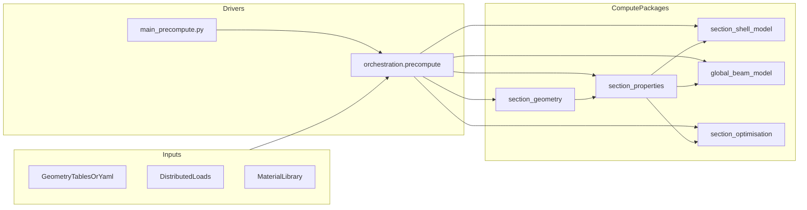

# blade_precompute Architecture

## Scope

This document defines module responsibilities and dependency direction for `blade_precompute`.
It complements `docs/conventions/API_CONVENTION.md` and captures the intended package-level boundaries.

## High-Level Data Flow

## Package Roles

- `orchestration`: stage sequencing, manifests, job I/O layout, cross-stage wiring.
- `section_geometry`: section shape, SDF, multicell topology, geometric exports.
- `section_properties`: strip/midsurface solve, `K6/K7`, section-level stress/failure helpers.
- `section_shell_model`: MITC4/CLPT shell diagnostics and optional section-level shell checks.
- `global_beam_model`: 1D beam FE solve, section-station interpolation, result projection.
- `section_optimisation`: design-vector evaluation and optimisation over spanwise section design.
- Run diagnostics and tensor/artifact logging are defined in `docs/architecture/RUN_LOGGING.md`.

## Dependency Rules

- Drivers import compute packages, not the reverse.
- Compute packages may depend on lower-level compute outputs (`section_properties` feeding beam/optimisation).
- Cross-package coupling must occur through typed public contracts (dataclasses/protocols), not internal module structures.
- `orchestration` must remain the only module that knows full run ordering.

## Review Checklist

Use this checklist for architecture changes:

1. Does any compute package import `orchestration`? If yes, redesign with an injected typed input.
2. Is a symbol duplicated across packages with diverging semantics?
3. Does a package expose one canonical entry path for analysis and one for visualisation?
4. Are naming and coordinate-frame conventions documented near the public types?
