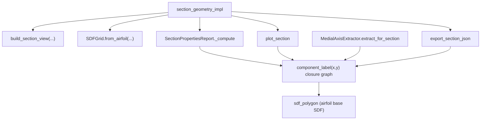

# section_geometry Computational Efficiency Review

## Scope

This review assesses computational-efficiency opportunities in `blade_precompute/section_geometry` and its orchestration path through `blade_precompute/orchestration/precompute/stages.py`.

It covers:

- Single-station hot paths (SDF evaluation, CSG composition, section properties, contour extraction, medial extraction).
- Cross-consumer duplicate work within a station.
- Multi-station orchestration opportunities (parallelism, adaptive griding, reuse).

## Executive Summary

- The dominant cost is repeated full-grid SDF evaluation of nested closure graphs, especially `sdf_polygon`, across multiple downstream consumers.
- `sdf_polygon` currently performs Python-loop edge iteration and large temporary array creation, which is a major vectorisation opportunity.
- Section property extraction currently uses multiple passes over the same masks and can be fused into one pass with no change in numerical intent.
- Export and plotting layers repeat expensive SDF evaluations and allocate matplotlib figures for contour extraction where a non-figure contour backend would suffice.
- The highest-leverage architecture change is introducing shared per-station evaluation caching and, later, a compiled CSG expression graph that materializes common subexpressions once.

## Current Data Flow and Recompute Pattern

## Findings

### A. Single-Station Hot Path

#### A1. `sdf_polygon` is Python-loop dominated

- Location: `blade_precompute/section_geometry/geometry/primitives.py` (`sdf_polygon`).
- Root cause: A Python `for` loop over each polygon edge computes edge distance and winding contribution per iteration.
- Cost mechanism: For typical grids (~768 x 330) and airfoil discretization (~200 points), each call creates many large temporaries and incurs Python dispatch overhead.
- Opportunity: Vectorize over an edge axis and reduce with `np.min` / `np.sum`, preserving sign convention and public API.
- Expected effect: High impact; this primitive sits under almost every section component evaluation.

#### A2. Lazy CSG closure composition causes deep re-evaluation

- Location: `blade_precompute/section_geometry/geometry/csg.py`, `blade_precompute/section_geometry/sections/multicell.py`, `blade_precompute/section_geometry/sections/subcomponents.py`.
- Root cause: Components are nested closures (`union/intersect/subtract/offset`) evaluated from scratch for each consumer call.
- Cost mechanism: Shared subexpressions (airfoil SDF, inner-skin offset, cap slabs, web unions) are recomputed repeatedly for each component and each consumer.
- Opportunity: Introduce shared per-grid materialization of common subexpressions or compile closure trees into cached arrays.
- Expected effect: High impact for full section bundles.

#### A3. Section property extraction uses redundant passes

- Location: `blade_precompute/section_geometry/geometry/grid.py` (`area`, `centroid`, `second_moments`, `section_properties`) and `blade_precompute/section_geometry/interface/export.py` (`SectionPropertiesReport._compute`).
- Root cause: Area, centroid, and moments call each other in a way that re-derives masks and intermediate quantities multiple times.
- Cost mechanism: Multiple complete passes over the same `phi < 0` mask per component.
- Opportunity: One fused method computing `A, cx, cy, Ixx, Iyy, Ixy` with a single mask and one set of accumulations.
- Expected effect: Medium-high impact proportional to number of components.

#### A4. Zero contour extraction allocates matplotlib figures in tight paths

- Location: `blade_precompute/section_geometry/geometry/grid.py` (`zero_contour`, `level_set`) and `blade_precompute/section_geometry/interface/export.py`.
- Root cause: Contour extraction uses `plt.subplots()` / contour set path extraction even when no plot artifact is needed.
- Cost mechanism: Figure creation and backend interaction inside data-export paths.
- Opportunity: Use `contourpy.contour_generator` directly for contour line extraction without figure allocation.
- Expected effect: Medium impact in JSON-heavy workflows.

#### A5. Twist handling wraps every component callable

- Location: `blade_precompute/section_geometry/sections/multicell.py` (global `rotate_field` wrap of all components).
- Root cause: Each component call includes transform pull-back logic for the same fixed twist and fixed grid.
- Cost mechanism: Repeated coordinate transform per-component per-consumer.
- Opportunity: Pre-transform query grids once per station for chord-frame evaluation, or cache transformed coordinates.
- Expected effect: Medium impact; grows with component count and consumer count.

#### A6. Repeated `np.asarray(..., dtype=float)` conversion in closures

- Location: multiple paths, including `geometry/primitives.py`, `geometry/transforms.py`, `sections/subcomponents.py`.
- Root cause: Defensive conversion on every call even when inputs are already `float64` ndarrays.
- Cost mechanism: Extra type checks, wrapper calls, and in some contexts unnecessary array copies.
- Opportunity: Introduce lightweight fast-path helpers that no-op on already-correct arrays.
- Expected effect: Low-medium impact; accumulates due to call frequency.

#### A7. Web anchor search uses 1-D scan + sign-change interpolation

- Location: `blade_precompute/section_geometry/sections/multicell.py` (`_inner_y_at_x`).
- Root cause: For each web station, a fixed 500-point scan in y estimates inner skin intercepts.
- Cost mechanism: Extra SDF evaluations per web and possible sensitivity to search bounds.
- Opportunity: Replace with robust geometric intersection against inner contour, or at least cache/reuse intermediate evaluations.
- Expected effect: Low-medium impact; additionally improves robustness.

#### A8. Medial extraction runs broad per-component evaluation

- Location: `blade_precompute/section_geometry/medial/extractor.py` (`extract_for_section`).
- Root cause: Evaluates all component SDFs independently, including components not always needed for downstream artifacts.
- Cost mechanism: Full-grid re-evaluation + gradient + morphology for each label.
- Opportunity: Support label filtering and shared eval cache injection.
- Expected effect: Medium impact where medial output is enabled.

### B. Cross-Consumer Recompute within a Station

#### B1. Same `(component, grid)` evaluated multiple times by design

- Location overlap:
  - `SectionPropertiesReport` in `blade_precompute/section_geometry/interface/export.py`.
  - `plot_section` in `blade_precompute/section_geometry/interface/plot.py`.
  - `MedialAxisExtractor.extract_for_section` in `blade_precompute/section_geometry/medial/extractor.py`.
  - `export_section_json` in `blade_precompute/section_geometry/interface/export.py`.
- Root cause: Consumers own their own `grid.eval(component)` calls and do not share field results.
- Cost mechanism: Duplicate full-grid evaluations across properties, plot, medial, and export on identical inputs.
- Opportunity: A station-local `SectionEvalCache` keyed by `(grid, component_label)` passed through all consumers.
- Expected effect: High impact in full report/export workflows.

### C. Multi-Station Orchestration

#### C1. Station loop is serial despite station independence

- Location: `blade_precompute/orchestration/precompute/stages.py` (`section_geometry_impl`).
- Root cause: Single-process loop over station indices.
- Cost mechanism: Under-utilized CPU for station-level embarrassingly parallel work.
- Opportunity: Process-based fan-out (`ProcessPoolExecutor`) with deterministic result ordering.
- Expected effect: High wall-clock improvement on multi-core machines.

#### C2. Grid resolution is fixed and high for all tasks

- Location: `blade_precompute/orchestration/precompute/stages.py` (`sdf_nx, sdf_ny = 768, 330`).
- Root cause: One hardcoded grid used for both property estimates and plot rendering.
- Cost mechanism: Properties incur high cost even when lower resolution is sufficient.
- Opportunity: Two-tier grid policy (`properties_grid`, `plot_grid`) with controlled error budget.
- Expected effect: High for runs with many stations.

#### C3. Airfoil generation has no memoization for repeated parameters

- Location: `blade_precompute/section_geometry/geometry/naca_parametric.py` and station builder path in orchestration.
- Root cause: Vertex generation repeats even when station parameters are identical or quantized.
- Cost mechanism: Repeated trigonometric and interpolation work.
- Opportunity: Add bounded `lru_cache` at spanwise-airfoil generation boundary.
- Expected effect: Low-medium, configuration-dependent.

### D. Architectural Step-Change Option: Compiled CSG Expression Graph

- Location anchor: `blade_precompute/section_geometry/geometry/csg.py` (`_eval` accepts callables and arrays).
- Observation: The current API already tolerates ndarray-backed fields, which makes migration feasible without public surface breakage.
- Proposal: Introduce an expression IR and compile it to memoized per-grid arrays with common-subexpression elimination.
- Why this is high leverage: It attacks both A2 and B1, turning repeated lazy closure traversal into bounded per-node evaluation.
- Compatibility path: Keep current callable-facing public APIs and back them with compiled/evaluated internals.

## Safety Notes (Why these optimisations are behavior-preserving)

- Vectorization in `sdf_polygon` changes evaluation strategy, not the signed-distance sign convention.
- Fusing property integration changes pass count, not integral definitions (`A`, centroid, second moments).
- Replacing contour extraction backend preserves the contour level-set objective (`phi == 0`) while removing plotting overhead.
- Shared cache is a memoization layer over deterministic pure computations for fixed `(component, grid)`.
- Process-level station parallelism preserves station independence and can maintain deterministic output ordering at collection time.

## Priority Ranking

1. Shared eval cache across consumers (`B1`) and `sdf_polygon` vectorization (`A1`).
2. Fused section properties (`A3`) and adaptive grid strategy (`C2`).
3. Process-parallel station execution (`C1`) and contour backend replacement (`A4`).
4. Twist/grid transform optimization (`A5`), conversion fast-paths (`A6`), and web-anchor improvements (`A7`).
5. Compiled CSG expression graph as the larger architectural phase (`D`).

## Suggested Measurement Baseline

For each optimisation stage, record:

- Time per station for:
  - section build,
  - properties,
  - plot generation,
  - export.
- Number of `grid.eval` calls per component label (instrumentation counter).
- Wall-clock total for representative station sets (e.g., 5, 10, full job grid).

This baseline should be established before implementation to quantify each wave's realized gain.
